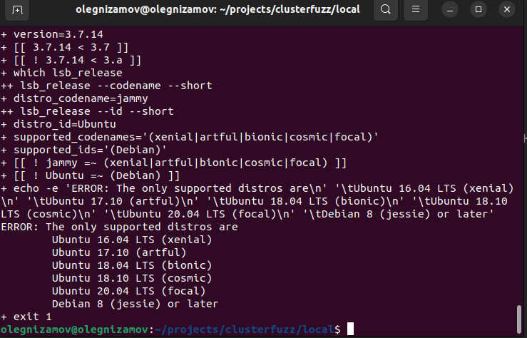
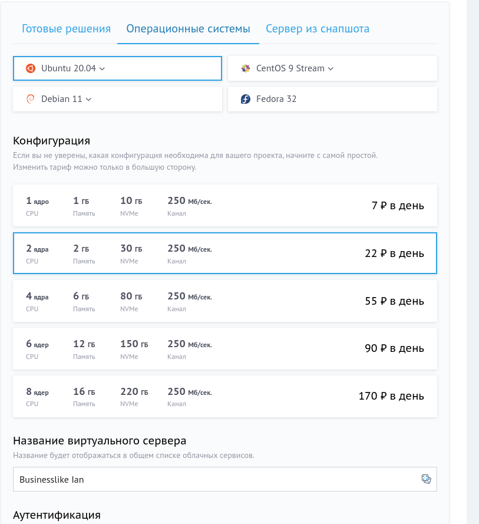
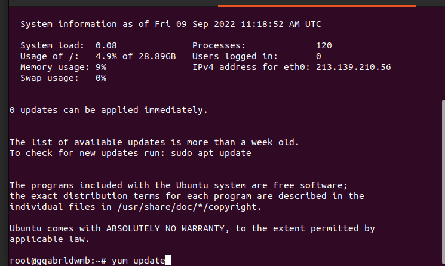
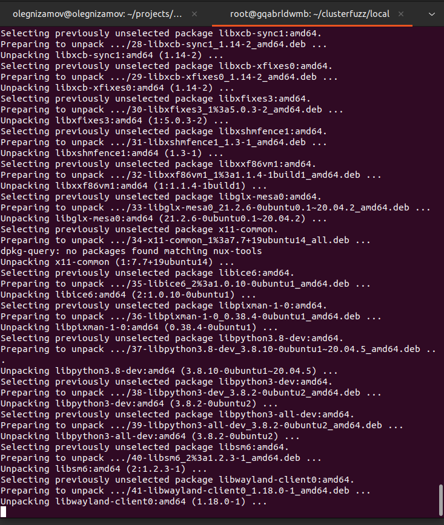
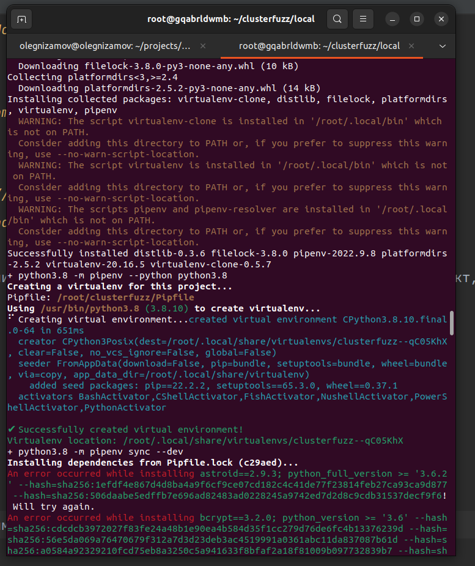
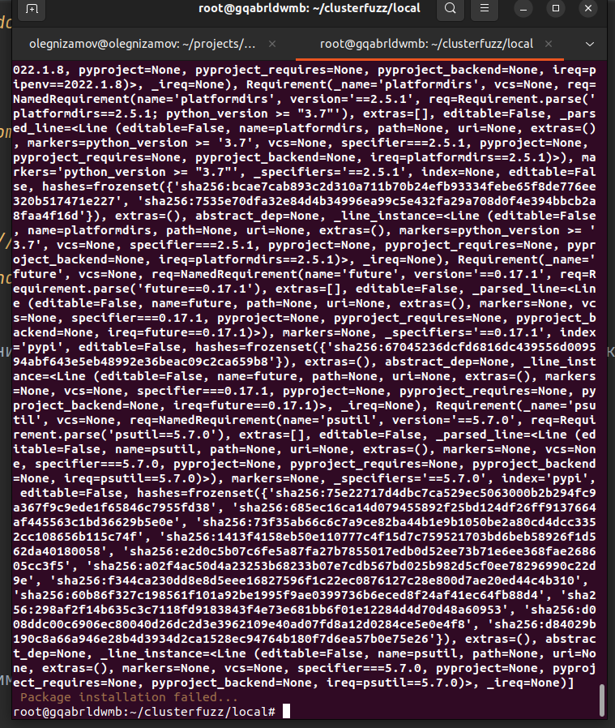
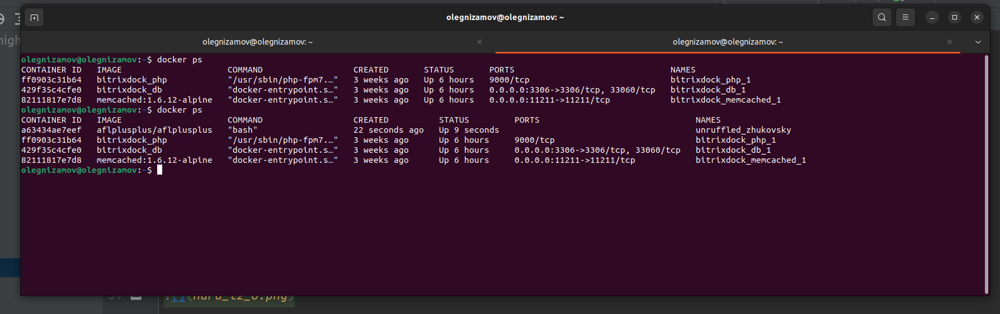
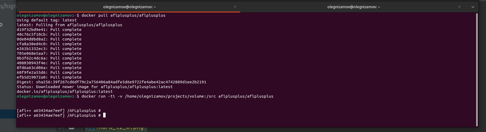
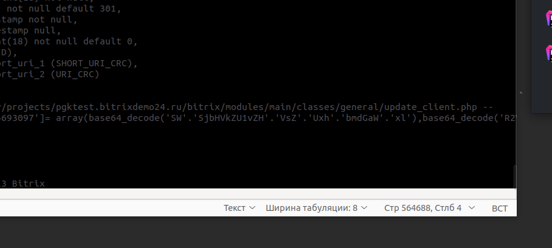
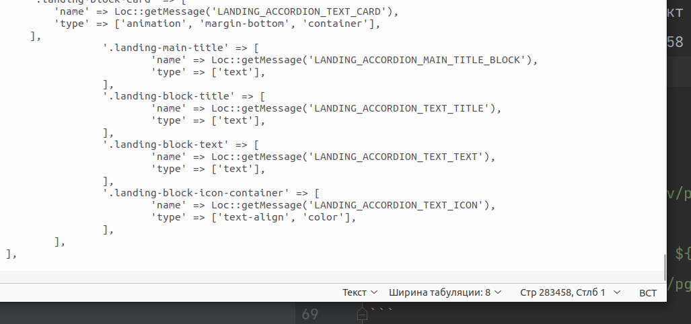

### Фазз-тестирование

Примените для одного из своих проектов фазз-тестирование.
Немного рассказывал о нём тут:
[https://vk.com/wall-152484379_3530](https://vk.com/wall-152484379_3530)
[https://vk.com/wall-152484379_3532](https://vk.com/wall-152484379_3532)

Используйте одну из следующих систем, на выбор (или любую другую :):

afl++
[github.com/AFLplusplus/AFLplusplus](https://github.com/AFLplusplus/AFLplusplus)

libfuzzer
[llvm.org/docs/LibFuzzer.html](https://llvm.org/docs/LibFuzzer.html)

ClusterFuzz
[github.com/google/clusterfuzz](https://github.com/google/clusterfuzz)

Быстрое введение в тему:
[habr.com/ru/company/bizone/blog/570312/](https://habr.com/ru/company/bizone/blog/570312/)
[habr.com/ru/company/dsec/blog/435644/](https://habr.com/ru/company/dsec/blog/435644/)

В отчёте напишите, какие трудности были при организации фазз-тестирования, на каком языке написан ваш проект, сколько в нём строк кода, и сколько ошибок в нём выявило фазз-тестирование.

### Решение

ClusterFuzz - на UBUNTU 22.04 не запускается


Окей, поднимем чистую Ubuntu 20.04 и все равно мимо..










AFLplusplus - на UBUNTU 22.04 попробуем через docker 

```
docker pull aflplusplus/aflplusplus
docker run -ti -v /home/olegnizamov/projects/volume:/src aflplusplus/aflplusplus
```
и даже запустилось.




Играемся с AFLplusplus

Я как понял он с C языками работает. 


Проект - Bitrix24 корпоративный портал. Монолитный монолит, реализованный на php. Есть как интеграции (rest-endpoint), 
так и просто реализация MVC архтитектуры.
1) В отчёте напишите, какие трудности были при организации фазз-тестирования - вообще php не поддерживается
2) на каком языке написан ваш проект - php
3) Cколько в нём строк кода - 283458 строк кастомной логики и кода (посчитал для php). В ядре находится -- 564688 строк 
Посчитал простым bash скриптом: 
```
#!/bin/bash

for file in `find /home/olegnizamov/projects/pgktest.bitrixdemo24.ru/local/ -type f -name "*.php"`
do
   echo -E -- ${file} -- && cat -- ${file} ;
done > //home/olegnizamov/projects/pgktest.bitrixdemo24.ru/local/nameFile.txt
```




4) сколько ошибок в нём выявило фазз-тестирование - не смог использовать для проекта. Нашел аналог через composer, однако думаю это не совсем то https://github.com/nikic/PHP-Fuzzer

Видео для подготовки:
https://www.youtube.com/watch?v=y_AqeZdFfXM
https://www.youtube.com/watch?v=8aWwRgorR4U
